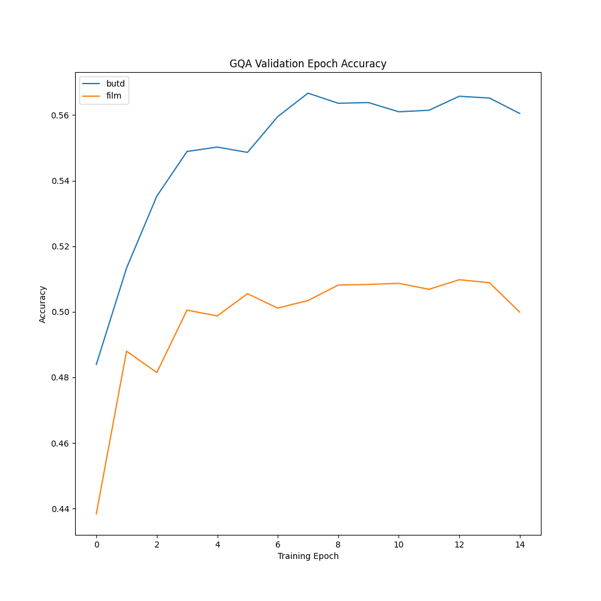
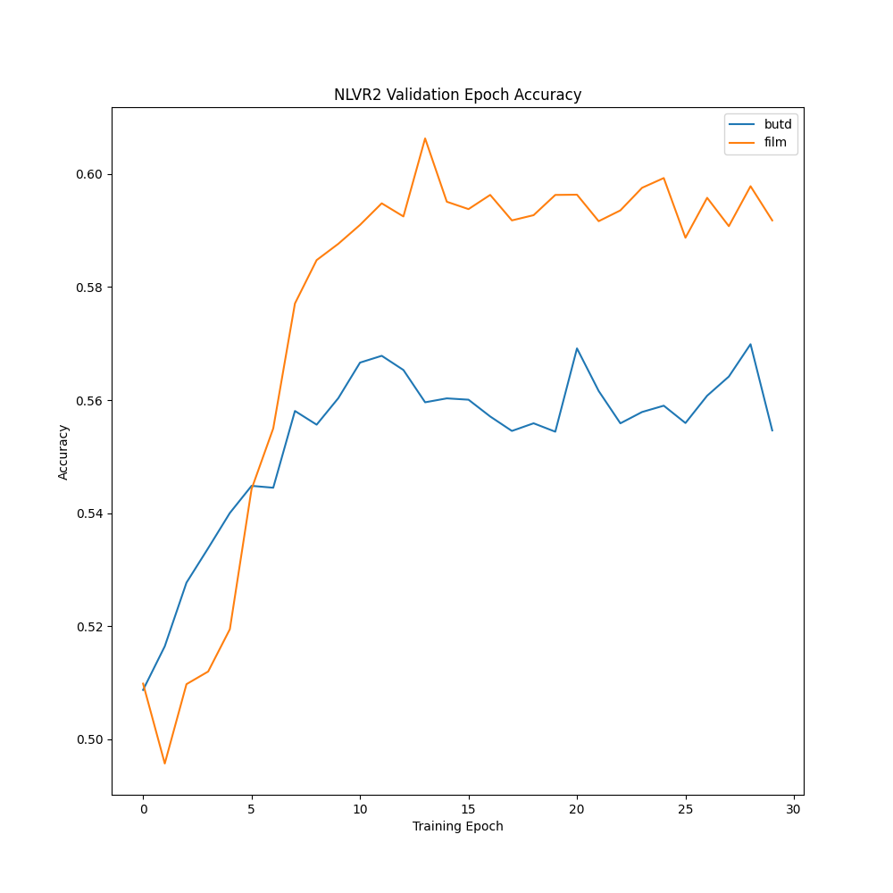
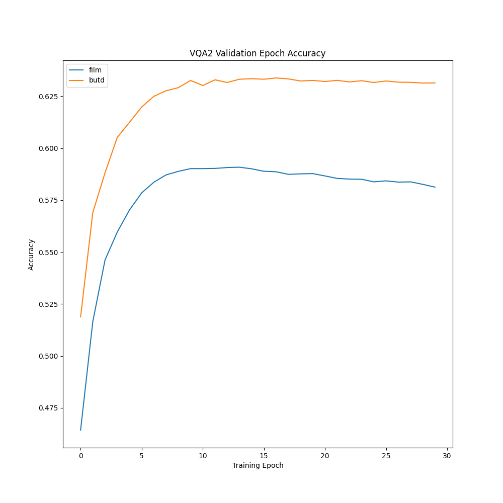

# Annotated Bottom-Up Top-Down Attention for Visual Question Answering

Companion Repository to the Annotated Bottom-Up Top-Down Attention (BUTD) for VQA Blog Post. 

The goal of this repository is to facilitate VQA research by making accessible a set of strong baseline VQA models 
(that don't rely on expensive pre-training!) that are easily hackable. 

Furthermore, by including pre-processing and training code for 3 common VQA datasets 
(GQA, NLVR-2, and VQA-2), we hope to make it easier to perform comprehensive cross-dataset evaluations in the future.

## About
The repository is factored into multiple branches:
 - The **[Modular Branch]** contains a fully factored version of the BUTD 
   codebase, broken apart into different modules for pre-processing, model creation, and training, for
   VQA2, GQA, and NLVR2. Use this branch for most research/development purposes.
   
 - The **[Streamlined-Dataset Branches]** contain a single-file annotated version of the BUTD codebase 
   for each of the various VQA tasks. Use these branches to slowly step through the code (to better understand 
   pre-processing intricacies, model design choices, etc.)
 
## Repository Overview
This branch (**[Modular]**) contains the following components:

- `scripts/` - Helpful bash scripts for downloading questions and image features from each of the VQA Datasets
    + `glove.sh` - Script for downloading pre-trained GloVe Word Vectors for initializing BUTD RNN language encoder
- `src/` - Source Code
    + `logging/` - Helpful logging utilities
    + `models/` - Core Model Definition scripts for both the Bottom-Up Top-Down and Bottom-Up FiLM Models
    + `preprocessing/` - Preprocessing utilities for each of the three VQA Datasets
- `train.py` - Core script for launching BUTD/BU-FiLM training for any of the three VQA Datasets. This is the entry
               point to the code base.

## Quickstart

Use these commands to quickly get set up with this repository, and start running experiments on GQA, NLVR-2, and VQA-2.

```bash 
# Clone the Repository
git clone https://github.com/siddk/annotated-butd.git
cd annotated-butd

# Create a Conda Environment using `environment.yml`
conda env create -f environment.yml 
```

Download the data -- GloVe Vectors, Question Files, and Bottom-Up Image Features (for your chosen datasets). 

**Warning:** These datasets take up a lot of disk space!

```bash
./scripts/glove.sh

# GQA
./scripts/gqa.sh

# NLVR-2
./scripts/nlvr2.sh

# VQA-2
./scripts/vqa2.sh
```

**Note about Object Features:** These features are kindly provided by UNC CS, as part of the 
[LXMERT](https://github.com/airsplay/lxmert) codebase. If you run into any issues downloading the Bottom-Up Object
Features, I highly suggest reading their README.

Furthermore, if you'd like to extract your own Bottom-Up Features for an image dataset of your choosing, feel free to 
use Peter Anderson's original [Bottom-Up Attention codebase](https://github.com/peteanderson80/bottom-up-attention), or
the [Docker Instructions in the LXMERT Repo](https://github.com/airsplay/lxmert#feature-extraction-with-docker).

## Start-Up (from Scratch)

Use these commands if you don't use Conda/don't trust the environment.yml for whatever reason. The following contains
step-by-step instructions for creating a new Conda Environment and installing the necessary dependencies.

```bash
# Create & Activate Conda Environment
conda create --name annotated-butd python=3.7
conda activate annotated-butd

# Mac OS/Linux (if using GPU, make sure CUDA already installed)
conda install pytorch torchvision -c pytorch
conda install ipython jupyter 
pip install pytorch-lightning typed-argument-parser h5py opencv-python matplotlib
``` 

Then, follow the instructions above for downloading the data!

## Training Models
Once data has been downloaded, you can run the following instructions to train models on the dataset of your choosing:

```
# GQA - Omit --gpus argument if running on CPU
python train.py --run_name GQA-BUTD --gpus 1 --dataset gqa --model butd
python train.py --run_name GQA-BU-FiLM --gpus 1 --dataset gqa --model film

# NLVR-2
python train.py --run_name NLVR2-BUTD --gpus 1 --dataset nlvr2 --model butd
python train.py --run_name NLVR2-BU-FiLM --gpus 1 --dataset nlvr2 --model film

# VQA-2
python train.py --run_name VQA2-BUTD --gpus 1 --dataset vqa2 --model butd
python train.py --run_name VQA2-BU-FiLM --gpus 1 --dataset vqa2 --model film
```
   
## Results

The following are Validation Accuracy results for both the BUTD and BU-FiLM models on each of the VQA Datasets:

GQA                        |  NLVR-2                         | VQA-2
:-------------------------:|:------------------------------:|:------------------------:
  |   | 